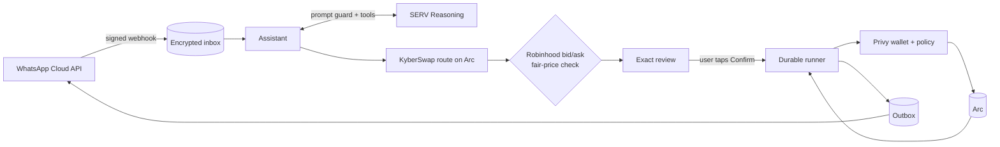

<div align="center">


# Pollenstocks

### Own US stocks with just USDC, right in WhatsApp.

Buy and sell **NVIDIA, Circle, GameStop and AMC** stock tokens on **Arc**, Circle's chain.<br/>
On Arc, **USDC also pays the network fee**: one coin for everything, no gas token to buy.<br/>
**Nothing moves until you tap Confirm.**


**Arc Microgrants · Mainnet challenge**

</div>

---

## 💡 The problem

People in emerging markets want US stocks to protect their savings. Tokenized stocks make that possible, but buying one still means installing a wallet, saving a seed phrase, and, worst of all, **buying a second coin just to pay gas** before the first trade. That is where most newcomers give up.

## ✨ The solution

Pollenstocks is a WhatsApp assistant on Arc:

```text
You:          Buy NVIDIA with 5 USDC

Pollenstocks:  Buy NVIDIA (NVDA)
              Arc

              Pay: 5 USDC
              Receive: ≈ 0.02161 NVDA tokens
              Minimum: 0.02139 NVDA tokens
              Network fee: up to 0.01 USDC
              Expires: 14:32 UTC

              [ Confirm buy ]  [ Details ]  [ Cancel ]

You:          Confirm buy

Pollenstocks:  Trade complete ✅  https://explorer.arc.io/tx/0x…
```

- **One coin.** Fund your wallet with USDC and you're done: trades, payments and network fees all use it. A trade costs under one cent in fees.
- **No app, no seed phrase.** Each user gets a Privy server wallet when they create an account in WhatsApp.
- **Plain language.** SERV Reasoning understands "buy nvidia with five dollars" or "sell 0.01 nvdia", behind a prompt-injection guard.

## 💬 Things you can say

```text
Buy NVIDIA with 5 USDC
What would 10 USDC get me in Circle?
Sell 0.01 NVIDIA
What are the prices?
Show my stocks
Send 2 USDC to Ada
How do I add money?
```

## 🛡️ Built so the AI can't move your money

| Guard                   | How                                                                                                                                                |
| ----------------------- | -------------------------------------------------------------------------------------------------------------------------------------------------- |
| The AI can't send       | SERV only gets read and prepare tools. Confirmation is a WhatsApp button handled by code.                                                          |
| Prompt-injection guard  | Every SERV request runs `serv_prompt_guard`; a flagged message is refused before any tool runs.                                                    |
| Fair price or nothing   | Each KyberSwap route is checked against Robinhood's live bid/ask; more than 2% worse, or a halted stock, is refused.                               |
| No copycat tokens       | Arc has fake tokens with the same names. Only pinned addresses trade, verified on-chain (code, symbol, decimals, issuer owner) before every trade. |
| Wallet policy           | The Privy policy allows only USDC or stock `approve`, KyberSwap `swap` and USDC `transfer`, on chain 5042 with zero native value.                  |
| Pinned router           | KyberSwap's router and executor on Arc are pinned by bytecode hash; calldata is decoded and matched to the review.                                 |
| Exact, expiring reviews | Minimum received and maximum fee are shown; a review expires after 4 minutes and confirms once.                                                    |

## 📈 Stocks on Arc

| Stock          | Token on Arc                                 |
| -------------- | -------------------------------------------- |
| NVIDIA (NVDA)  | `0x6505506540dC99f7366316B10E9CF1A584cbD42a` |
| Circle (CRCL)  | `0x2ba0f44BDfC17FbA30edA9cdBeCB908cA45B043B` |
| GameStop (GME) | `0x41B386E03928c70D635606C210717C19DCfC984d` |
| AMC (AMC)      | `0x0056eD10eA5a504a2Cc9BeC93aA5Fa8258bBa0C7` |

These are "• Arc Token" stock tokens from a single third-party issuer, who describes them as backed 1:1 by Robinhood Chain stock tokens. They are not direct share ownership and their liquidity on Arc is still small, so Pollenstocks is built for small trades and refuses unfair prices.

## 🏗️ Architecture



| Part        | Technology                                                |
| ----------- | --------------------------------------------------------- |
| App and API | Next.js 16 · TypeScript · viem · zod                      |
| AI          | SERV Reasoning with tool calling and `serv_prompt_guard`  |
| Chain       | Arc mainnet (5042), USDC as money and gas                 |
| Trading     | KyberSwap aggregator on Arc                               |
| Fair prices | Robinhood's public stock-token bid/ask                    |
| Wallets     | Privy server wallets with a generated allow-list policy   |
| Messaging   | WhatsApp Cloud API                                        |
| Storage     | SQLite on a persistent volume, sensitive fields encrypted |

## 🛠️ Run it yourself

```bash
git clone https://github.com/Yilkash/pollenstocks.git
cd pollenstocks/apps/web
npm ci
cp .env.example .env.local   # add your own keys; never commit this file
npm run dev                  # website
npm run whatsapp:worker      # WhatsApp and transaction workers
```

See [`docs/SETUP.md`](docs/SETUP.md) for every setting and the deployment steps, and [`docs/ARCHITECTURE.md`](docs/ARCHITECTURE.md) for the trade lifecycle.

```bash
npm run format:check && npm run typecheck && npm test && npm run build
```

## ⚠️ Limitations

- Four stocks today, because few stock tokens trade on Arc yet. More can be added as issuers bring them (Circle has said Dinari and xStocks are coming).
- Thin liquidity on Arc: suited to small trades; larger orders are refused when the price drifts.
- The stock tokens come from one third-party issuer whose contracts are controlled by a single key. Pollenstocks pins and verifies them but cannot vouch for the backing.

<div align="center">

**Pollenstocks by Steward Pay** · Stock tokens on Arc are not direct share ownership.

</div>
