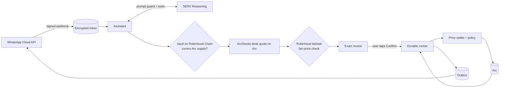

<div align="center">


# Pollenstocks

### Own US stocks with just USDC, right in WhatsApp.

Buy and sell **NVIDIA, Tesla, Apple, Amazon, Meta, Google, the S&P 500 and the Nasdaq-100** on **Arc**, Circle's chain.<br/>
Every stock token is **backed 1:1, and Pollenstocks proves it on-chain before each trade**.<br/>
On Arc, **USDC also pays the network fee**: one coin for everything, no gas token to buy.<br/>
**Nothing moves until you tap Confirm.**

[](https://wa.me/2347062750162?text=Hi)


**Arc Microgrants · Mainnet challenge**

</div>

---

## 💡 The problem

People in emerging markets want US stocks to protect their savings. Tokenized stocks make that possible, but buying one still means installing a wallet, saving a seed phrase, and, worst of all, **buying a second coin just to pay gas** before the first trade. That is where most newcomers give up.

## ✨ The solution

Pollenstocks is a WhatsApp assistant on Arc:

```text
You:          Buy NVIDIA with 5 USDC

Pollenstocks:  Buy NVIDIA (NVDA)
              Arc

              Pay: 5 USDC
              Receive: ≈ 0.02121 NVDA tokens
              Minimum: 0.02099 NVDA tokens
              Network fee: up to 0.01 USDC
              Expires: 14:32 UTC

              ✅ Backed 1:1: vault verified on Robinhood Chain

              [ Confirm buy ]  [ Details ]  [ Cancel ]

You:          Confirm buy

Pollenstocks:  Trade complete ✅  https://explorer.arc.io/tx/0x…
```

- **One coin.** Fund your wallet with USDC and you're done: trades, payments and network fees all use it. A trade costs under one cent in fees.
- **No app, no seed phrase.** Each user gets a Privy server wallet when they create an account in WhatsApp.
- **Proven backing.** Before every review and again before sending, Pollenstocks reads the token's supply on Arc and the vault's holdings on Robinhood Chain. If the vault doesn't cover the supply, it won't trade.
- **Plain language.** SERV Reasoning understands "buy nvidia with five dollars" or "sell 0.01 nvdia", behind a prompt-injection guard.

## 💬 Things you can say

```text
Buy NVIDIA with 5 USDC
What would 10 USDC get me in Tesla?
Sell 0.01 NVIDIA
What are the prices?
Show my stocks
Send 2 USDC to Ada
How do I add money?
```

## 🛡️ Built so the AI can't move your money

| Guard                   | How                                                                                                                                       |
| ----------------------- | ----------------------------------------------------------------------------------------------------------------------------------------- |
| The AI can't send       | SERV only gets read and prepare tools. Confirmation is a WhatsApp button handled by code.                                                 |
| Prompt-injection guard  | Every SERV request runs `serv_prompt_guard`; a flagged message is refused before any tool runs.                                           |
| Backed 1:1, live        | Each token's Arc supply is compared with ArcStocks' vault holdings on Robinhood Chain before the review and again right before sending.   |
| Fair price or nothing   | Every desk quote is checked against Robinhood's live bid/ask; more than 2% worse, or a halted stock, is refused.                          |
| Pinned venue            | The ArcStocks desk proxy, its implementation address and its code are pinned by hash. An upgrade or a pause stops trading until reviewed. |
| Pinned tokens           | Only pinned token addresses trade, verified on-chain (code, `.arc` symbol, decimals). Copycats with the same names are never used.        |
| Wallet policy           | Privy allows only stock `approve`, USDC `transfer`, desk `sell`, and desk `buy` with at most the per-trade USDC cap, all on chain 5042.   |
| Exact, expiring reviews | Calldata is built and re-checked by code; minimum received and maximum fee are shown; a review expires after 4 minutes and confirms once. |

## 📈 Stocks on Arc

| Stock                | Token on Arc                                 | Backed by (Robinhood Chain)                  |
| -------------------- | -------------------------------------------- | -------------------------------------------- |
| NVIDIA (NVDA)        | `0x0A2dd7160De0c452ED4642d498162550Fe2165f2` | `0xd0601CE157Db5bdC3162BbaC2a2C8aF5320D9EEC` |
| Tesla (TSLA)         | `0x349dcB3a576813FFbAB4B88547A0D694eb20EB18` | `0x322F0929c4625eD5bAd873c95208D54E1c003b2d` |
| Apple (AAPL)         | `0xdC79A6e977Eb1668B6BFF7aC788053305ffF13C9` | `0xaF3D76f1834A1d425780943C99Ea8A608f8a93f9` |
| Amazon (AMZN)        | `0x468B1D1f51c8EC186172C2386a0BED6Bcf99aDD8` | `0x12f190a9F9d7D37a250758b26824B97CE941bF54` |
| Meta (META)          | `0xEb88c032788bc9aDc4671C10C19b95F9B93A2E37` | `0xc0D6457C16Cc70d6790Dd43521C899C87ce02f35` |
| Alphabet (GOOGL)     | `0x5606e025C05Dd41EA485b19490632E09F3ec03B8` | `0x2e0847E8910a9732eB3fb1bb4b70a580ADAD4FE3` |
| S&P 500 ETF (SPY)    | `0x8645EB2EF4D5A7c46212EB7688547442126c7b48` | `0x117cc2133c37B721F49dE2A7a74833232B3B4C0C` |
| Nasdaq-100 ETF (QQQ) | `0xC2017F980b6b3f1D149541cF692c1971e53383D4` | `0xD5f3879160bc7c32ebb4dC785F8a4F505888de68` |

The tokens are issued by [ArcStocks](https://astock.fi): each one is minted on Arc only after ArcStocks' vault on Robinhood Chain (`0xe77b3b55e75d8f5b484ce677fa9231f9181b1bcd`) holds the same Robinhood stock token. Trades go through the ArcStocks desk on Arc (`0x3ac68fc2ad55599fa528fefa1f05cc1c1df26d69`): one transaction, USDC in, shares out, in seconds. They are stock tokens, not direct share ownership.

Check the backing yourself:

```bash
cast call 0x0A2dd7160De0c452ED4642d498162550Fe2165f2 "totalSupply()(uint256)" --rpc-url https://rpc.mainnet.arc.io
cast call 0xd0601CE157Db5bdC3162BbaC2a2C8aF5320D9EEC "balanceOf(address)(uint256)" 0xe77b3b55e75d8f5b484ce677fa9231f9181b1bcd --rpc-url https://rpc.mainnet.chain.robinhood.com
```

## 🏗️ Architecture



| Part        | Technology                                                |
| ----------- | --------------------------------------------------------- |
| App and API | Next.js 16 · TypeScript · viem · zod                      |
| AI          | SERV Reasoning with tool calling and `serv_prompt_guard`  |
| Chain       | Arc mainnet (5042), USDC as money and gas                 |
| Trading     | ArcStocks desk on Arc, backing read from Robinhood Chain  |
| Fair prices | Robinhood's public stock-token bid/ask                    |
| Wallets     | Privy server wallets with a generated allow-list policy   |
| Messaging   | WhatsApp Cloud API                                        |
| Storage     | SQLite on a persistent volume, sensitive fields encrypted |

## 🛠️ Run it yourself

```bash
git clone https://github.com/Yilkash/pollenstocks.git
cd pollenstocks/apps/web
npm ci
cp .env.example .env.local   # add your own keys; never commit this file
npm run dev                  # website
npm run whatsapp:worker      # WhatsApp and transaction workers
```

See [`docs/SETUP.md`](docs/SETUP.md) for every setting and the deployment steps, and [`docs/ARCHITECTURE.md`](docs/ARCHITECTURE.md) for the trade lifecycle.

```bash
npm run format:check && npm run typecheck && npm test && npm run build
```

## ⚠️ Limitations

- Eight stocks today: the ones the ArcStocks desk trades. ArcStocks has more names that settle only through its slower cross-chain route.
- The desk holds a few hundred dollars of each stock and fills up to 500 USDC per trade, so Pollenstocks is built for small trades.
- ArcStocks controls the desk contract and can upgrade it. Pollenstocks pins the code and stops trading if it changes, but it cannot stop an upgrade.

<div align="center">

**Pollenstocks by Steward Pay** · Stock tokens on Arc are not direct share ownership.

</div>
